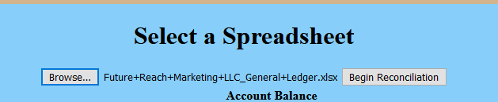
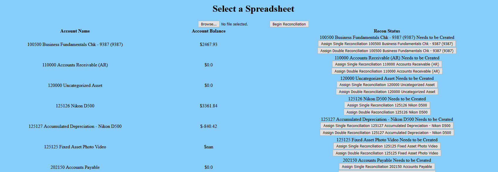
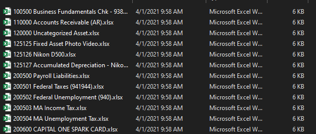

# Quickbooks-Account-Reconciliation
Utilizing Flask and Pandas, this program can take a properly formatted General Ledger report and convert every GL 
account within the report into a formatted spreadsheet to streamline account reconciliation. 

(For A Video Sample: https://www.youtube.com/watch?v=duRMYLWJh6c&t=1s)

When you start up the program, a random port number will be assigned to flask and the user will be prompted with a URL
the can click on to launch the GUI. The program will make sure that there is a "Recons" folder in the current directory 
as well as make sure that there is a folder for the current month located within the Recons folder. 

From the home page, the user can click on "Go To Recon Page" or exit the program. 

On the Recon Page, the user wil be prompted to upload a spreadsheet. 

The user can select the spreadsheet from wherever it is located on your computer and click the 
"Begin Reconciliation" button.

The program will iterate through every account number found in the spreadsheet and record the account number and the 
accounts ending balance. The program will then check the Recons folder for the current month and record what spreadsheets
have already been created for the month. 

If there is already a spreadsheet created for a current account number, the program will open that spreadsheet, create a
new tab, date the tab with the current date, and input the account balance. That account/spreadsheet is not ready to be
reconciled! The program will output this information to the GUI.

If the program finds that there is an account number found in the General Ledger, but it does not  find a spreadsheet 
with the same name located in the current month folder, the program will let the user know this information on the GUI 
and prompt the user with two buttons to assign a "single-reconciliation" or a "double-reconciliation" to that particular
account.

If the GL account represents something that will have supporting external documents to back it up, like a bank account 
statement or a credit card statement, the user should opt for the "double-reconciliation" option. If the GL account does 
not have supporting external documents like taxes payable, then the user should opt for the "single-reconciliation" 
option. Every time the user presses a button, a confirmation of the users choice is output to the bottom of the GUI.

Congratulations! You can now begin the reconciliation process. This program can be reran every time a new GL is created.

